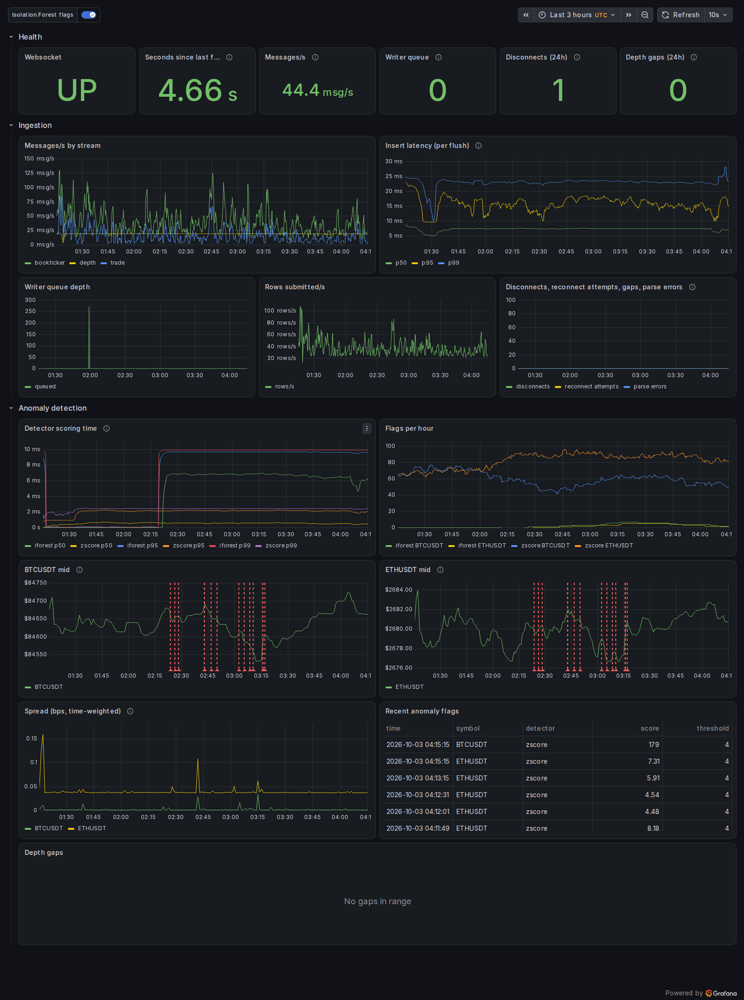
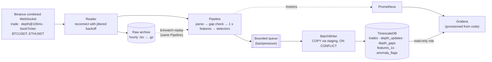

# tickwatch

A live market-data pipeline that ingests Binance trades, order-book updates and
best bid/ask for BTCUSDT and ETHUSDT, stores them in TimescaleDB, and runs two
online anomaly detectors over per-second features. It is built to be measured,
replayed and operated: every performance number below comes from a script in
the repo, and the raw stream is archived so any period can be reprocessed
deterministically.

**Status:** not running anywhere right now. It ran under Docker Compose on a
development laptop from 2026-10-02 to 2026-10-03 and is **not deployed to an
always-on host**; the numbers in this README are from that machine (Apple M4
Pro, Docker Desktop), not from a server. To run it yourself, see
[Getting it running](#getting-it-running) -- about five minutes.



## Architecture



- **Reader** keeps one combined-stream connection, reconnects forever with
  full-jitter exponential backoff, and archives every frame *before* parsing
  it, so a parser bug can never lose data.
- **Pipeline** is the only code that handles a frame after it arrives. Live
  ingestion and replay both call it, so replay runs exactly the code that
  processed the data live.
- **Gap detection** checks Binance's diff-depth rule (each update's first ID
  `U` must equal the previous final ID `u` + 1) per symbol and records every
  break, attributed to a reconnect or to the stream.
- **Features** are per symbol per second: trade count, notional, time-weighted
  spread, mid price, absolute return.
- **Detectors**: a rolling z-score (5-minute baseline) and a per-symbol
  Isolation Forest (refit every 10 minutes on the trailing hour, in a worker
  thread, swapped in at a fixed bucket count so replay is deterministic).

## Measured results

### Write throughput: 1,193 → 61,340 rows/s (51x)

Replaying a fixed 15-minute recording (126,520 rows) into a scratch database,
median of 3 runs. Full method, caveats and raw results in
[`benchmarks/`](benchmarks/README.md).

| Writer | rows/s | vs naive |
|---|---:|---:|
| One `INSERT` + `COMMIT` per row (baseline) | 1,193 | 1x |
| Batched, pipelined `INSERT` (batch 500) | 20,551 | 17x |
| Batched `COPY` via staging table (batch 500) | 47,098 | 40x |
| Same, batch 2,000 (chosen from a size sweep) | 69,133 | 58x |
| **Same + `(symbol, time DESC)` index — what runs live** | **61,340** | **51x** |

Two costs measured rather than hidden: idempotent writes (COPY can't skip
duplicates, so rows go through a staging table) cost **43%** of raw COPY
throughput, and the query index below costs **11%** of write throughput.

### Query: latest trade per symbol, 26.4 ms → 0.018 ms

`EXPLAIN ANALYZE` before and after adding `(symbol, time DESC)`: the plan goes
from reading and sorting every row (102k rows, sort spilling to disk) to a
TimescaleDB SkipScan touching 8 buffer pages. An alternative that reused the
primary key was tested and didn't help.

### Resilience, tested against real failures

| Event | Result |
|---|---|
| Network loss (laptop slept, 2026-10-02) | Keepalive detected the dead socket; DNS failures retried with bounded backoff; no crash |
| Clean server close (Binance's 24 h close, simulated) | Reconnects in 0.3-0.6 s; the depth gap it causes is recorded, not silent |
| Database restart under the consumer | Container restarts automatically, writing again in ~5 s |
| `docker compose stop` | Drains the queue and exits 0 in 2.3 s |
| SIGTERM mid-stream after a disconnect | Archive and database match exactly: 2,470 frames, 2,470 rows |

### Replay is deterministic

Replaying 32 minutes of live archive (171,118 frames) into a fresh database
produced a SHA-256 over every row and column identical to what the live
consumer wrote. Replay runs at ~20,000-47,000 frames/s.

### Detector comparison (3 hours, 2026-10-03)

[Full report](docs/reports/2026-10-03-detector-comparison.md). The short
version:

| | BTCUSDT | ETHUSDT |
|---|---:|---:|
| z-score flags (\|z\| > 4) | 62.8/h (1.75% of seconds) | 84.8/h (2.36%) |
| Isolation Forest flags (99.9th pct) | 4.0/h (0.11%) | 3.0/h (0.08%) |
| Top-1% overlap at matched alarm rates (chance = 1%) | 71% | 49% |

At their thresholds the two detectors look like they disagree completely, but
that is calibration: the fixed 4-sigma threshold fires constantly on overnight
returns, which are mostly zero. Asked to flag the same number of seconds, they
largely pick the same ones, and their strongest agreements on BTC and ETH fall
on the same two seconds. There are no labels, so this compares behaviour, not
accuracy.

### Live run at time of writing (2026-10-03 04:15 UTC)

| | |
|---|---|
| Consumer uptime | 2 h 56 min since last start, 0 restarts, healthy |
| Frames received since start | 794,137 |
| Stored in total | 1,414,777 trades · 571,219 depth updates · 37,324 feature-seconds · 722 anomaly flags |
| Depth sequence gaps since start | 0 |
| Insert latency (last hour, per batch) | p50 7.4 ms · p99 23 ms |
| Detector scoring (last hour, per bucket) | z-score ~0.5 ms · Isolation Forest ~6.5 ms |
| Database size | 629 MB |

Scoring inside the container is slower than the same code measured directly
on the host (0.043 ms and 1.7 ms); the percentiles above are interpolated
within histogram buckets.

## Getting it running

Everything runs in Docker: the database, the consumer, Prometheus and Grafana.
You don't need Python installed unless you want to run the tests.

**1. Install the prerequisites.** [Docker Desktop](https://www.docker.com/products/docker-desktop/)
(macOS/Windows) or Docker Engine with the Compose plugin (Linux), and git.
Start Docker and check it works:

```bash
docker compose version
```

**2. Get the code.**

```bash
git clone https://github.com/seifzogheibi/tickwatch.git
cd tickwatch
```

**3. Create `.env` with your own passwords.** This copies the template and
fills the three passwords with random values (the file is gitignored):

```bash
sed -e "s/^PGPASSWORD=.*/PGPASSWORD=$(openssl rand -hex 16)/" \
    -e "s/^GRAFANA_ADMIN_PASSWORD=.*/GRAFANA_ADMIN_PASSWORD=$(openssl rand -hex 12)/" \
    -e "s/^GRAFANA_DB_PASSWORD=.*/GRAFANA_DB_PASSWORD=$(openssl rand -hex 16)/" \
    .env.example > .env
```

**4. Start it.** The first run builds the image and downloads the others,
which takes a few minutes:

```bash
docker compose up -d --build
```

**5. Check it's working.** After about a minute all four services should be
up and the consumer should say `healthy` (it's healthy once market data is
arriving):

```bash
docker compose ps
```

**6. Open the dashboard** at http://localhost:3000. Log in as `admin` with the
password from `.env`:

```bash
grep GRAFANA_ADMIN_PASSWORD .env
```

Charts fill in as data arrives. The Isolation Forest needs an hour of data
before its first flag; the z-score starts after a minute.

### Stopping and starting

```bash
docker compose stop        # stop everything; all data is kept
docker compose start       # start again where it left off
docker compose logs -f consumer   # watch the consumer's log
```

Data lives in Docker volumes and survives `stop`/`start` and reboots. Only
`docker compose down -v` deletes it -- the database, the raw archive and the
dashboards' history -- so don't add `-v` unless you mean to start from zero.

Everything binds to localhost only. Prometheus is at http://localhost:9090.
Replaying the archive, benchmarks and the planned VPS steps are in
[`docs/deploy.md`](docs/deploy.md).

### Notes

- **Binance availability:** the consumer connects to `stream.binance.com`,
  which is blocked in some countries (including the US). If the consumer
  never turns healthy, check `docker compose logs consumer` for connection
  errors.
- **A laptop sleeping stops collection.** The consumer reconnects on its own
  when the machine wakes, but nothing is recorded while it sleeps.

### Development

```bash
python3 -m venv .venv && .venv/bin/pip install -e ".[dev]"
.venv/bin/pytest                      # 76 tests; 3 need the database from step 4
.venv/bin/pytest -m "not integration" # unit tests only, no database needed
.venv/bin/ruff check . && .venv/bin/ruff format --check .
```

## Repository map

| Path | What |
|---|---|
| `src/tickwatch/` | consumer, pipeline, parser, gap detector, archive, features, detectors, writer, metrics |
| `tests/` | 76 tests, including a real-archive fixture and replay against Postgres; mutation-checked |
| `benchmarks/` | insert and query benchmarks, recordings, raw results |
| `analysis/compare_detectors.py` | the detector comparison report |
| `ops/` | Prometheus config; Grafana provisioning and the dashboard generator |
| `docs/` | deploy guide, known limitations, incident reports, reports |

## What I'd do next

The honest gaps, roughly in priority order. Details and measurements are in
[`docs/known-limitations.md`](docs/known-limitations.md) and
[`docs/incidents/`](docs/incidents/).

1. **Deploy it to an always-on host and leave it running.** Two outages on
   2026-10-02 (a Docker VM failure, 15 min; the laptop sleeping, 2 h 14 min)
   came from the host, not the code. Re-run the benchmarks there: Docker
   Desktop numbers won't transfer.
2. **Keep archiving when the database is down.** Today a sustained DB outage
   stops ingestion entirely, so that window is unrecoverable.
3. **Remove the daily reconnect gap.** Binance closes every connection after
   24 h, and even a 0.3 s reconnect skips 690-2,052 depth updates. Open the
   replacement connection before the close and dedupe by update ID.
4. **Calibrate the z-score to a target alarm rate** (rolling quantiles or a
   robust z) and evaluate both detectors against labelled events.
5. **Persist detector state** so a restart doesn't silence the forest for an
   hour, and **add retention** for the raw archive (~330 MB/day compressed).
6. **Alerting.** The dashboard shows staleness and disconnects, but nothing
   pages anyone yet.
